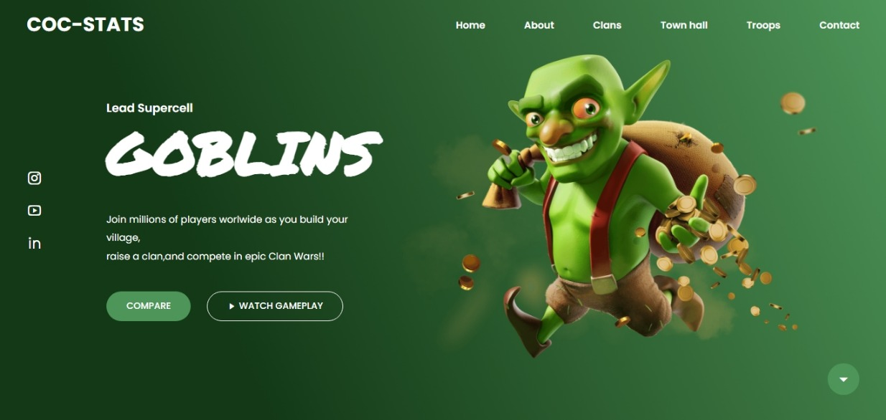

<h1 align="center"> GOBLIN </h1>

<h2 align="center">
Projeto desenvolvido com representação de Personagem do jogo Clash of Clans. 
Esta Landing Page é construida com responsividade para diversas telas com o auxílio da linguagem Java-Script.
</h2>

  Link para visualização:
  <a href="https://brunodevbbf.github.io/Goblin/">Clique Aqui</a>

<h2>Links Social</h2>

 

  

## 🚀 Tecnologias

Esse projeto foi desenvolvido com as seguintes tecnologias:

- HTML
- CSS
- JavaScript

